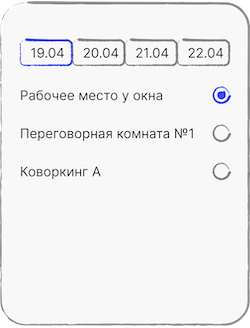

# НТО 2025. II отборочный этап. Командные задания — Android

## 📖 Предыстория

В компании S есть возможность бронирования мест в пространствах, предназначенных под общее использование (open-space). На данный момент для бронирования места используются различные способы бронирования, разработанные в каждом офисе индивидуально.
Администрации компании S требуется мобильное приложение, как для рядовых сотрудников, так и для администрации с возможностью просмотра забронированных мест.

## 📑 Технологический стек

- Минимальная версия ОС: Android 9.0 (API 28)
- Целевая версия ОС: Android 16 (API 36)
- Работоспособность приложения для платформ: mobile (смартфоны), tablet (планшеты)
- Поддерживаемая ориентация: портретная
- Поддержка языков: русский
- Разрешения: доступ к интернету
- Технический стек:
  - Compose/Compose Multiplatform
  - Ktor
  - MVVM/MVI

## 🛠️ Техническое задание

Требуется разработать нативное мобильное приложение, которое будет содержать следующие экраны. Необходимо учесть это поведение при проектировании обратной навигации.

### Экран авторизации

Данный экран должен быть показан в случае, если пользователь не авторизован в приложении. 

Элементы, которые должны присутствовать на экране:

1. Поле ввода (`auth_code_input`), в которое пользователь вводит уникальный код, полученный при трудоустройстве.
1. По умолчанию неотображаемое текстовое поле с ошибкой (`auth_error`). Отметим, что это поле не должно рендериться.
1. Кнопка (`auth_sign_button`), по нажатию на которую происходит вход.

Требования к компонентам:

1. В пустом поле ввода должна отображаться подсказка “Код”.
1. Кнопка должна быть неактивной, если выполняется хотя бы одно из следующих условий:
   - поле ввода пустое;
   - количество символов не равно 4;
   - уникальный код (логин) содержит любой другой символ, кроме латинского алфавита и цифр.
1. При раскрытии клавиатуры поле ввода и кнопку должно быть видно.
1. При нажатии на кнопку входа нужно проверить правильность введённого кода через запрос `api/<CODE>/auth` (подробности [здесь](https://git.sicampus.ru/Olympic/NTO-2025-Backend-TeamTask)).
1. В случае неверного кода или любой другой неполадки — необходимо вывести ошибку в элемент из п. 2, пока пользователь не изменит текстовое поле или повторно не нажмет на кнопку.
1. При успешном входе код сохраняется. При следующем открытии приложения экран авторизации отображаться не должен.
1. После успешной авторизации необходимо выполнить переход на Главный экран.

### Главный экран

Данный экран содержит информацию о пользователе и его текущие бронирования. Если пользователь авторизован, данный экран должен быть отображен при запуске приложения. 

Элементы, которые должны присутствовать на экране:

1. Текстовое поле (`main_name`), в котором написано имя пользователя.
1. Изображение (`main_photo`), на котором отображено фото пользователя.
1. Кнопка (`main_logout_button`) для выхода пользователя из аккаунта.
1. Кнопка (`main_refresh_button`) для принудительного обновления данных.
1. Кнопка (`main_add_button`) для бронирования.
1. Список, содержащий однотипные элементы (`main_book_pos_{индекс}`), со следующим содержимым:
1. Текстовое поле (`main_item_date`) с датой бронирования в формате `dd.MM.yyyy`.
1. Текстовое поле (`main_item_place`) с местом, которое забронировано.
1. По умолчанию скрытое текстовое поле с ошибкой (`main_error`).

Требования к компонентам:

1. В случае любой ошибки необходимо скрыть все элементы, кроме текстового поля с ошибкой и кнопки обновления данных.
1. Для получения данных необходимо использовать сетевой запрос `/api/<CODE>/info`.
1. При нажатии на кнопку для выхода, все сохранённые данные пользователя должны быть очищены, а приложение должно открыть экран авторизации.
1. При нажатии кнопки бронирования необходимо открыть экран бронирования.
1. При нажатии на кнопку обновления данных — необходимо повторно вызывать сетевой запрос для получения актуальных данных.
1. Список бронирований должен быть отсортирован в порядке увеличения даты (например, 5 января -> 6 января -> 9 января).

### Экран бронирования

На данном экране необходимо вывести возможные даты и места для бронирования.

Элементы, которые должны присутствовать на экране:

1. Группа вкладок. Каждая вкладка (`book_date_pos_{индекс}`) содержит текстовое поле (`book_date`) с датой бронирования в формате `dd.MM`.
1. В зависимости от выбранной даты необходимо отобразить группу с единственным выбором (пояснения на изображении ниже). Каждый элемент группы (`book_place_pos_{индекс}`) кликабелен и содержит:
    - Текстовое поле (`book_place_text`), в котором содержится место доступное для брони.
    - Селектор (`book_place_selector`), который отображает, выбран элемент или нет. У данного элемента обязательно наличие: (`Modifier.selectable`)
    
    
1. Кнопка (`book_book_button`) для бронирования.
1. Кнопка (`book_back_button`) для возвращения на предыдущий экран.
1. По умолчанию неотображаемое текстовое поле с ошибкой (`book_error`). Отметим, что это поле не должно рендериться.
1. По умолчанию неотображаемая кнопка обновить (`book_refresh_button`). 
1. По умолчанию неотображаемый текст “Всё забронировано” (`book_empty`).

Требования к компонентам:

1. По умолчанию выбирается самая ранняя доступная дата (например, из набора "5 января", "6 января", "9 января" будет показана дата "5 января").
1. Список дат отсортирован по возрастанию. Даты без доступных мест для бронирования необходимо не отображать.
1. Если нет доступных для бронирования дат, необходимо скрыть все элементы, кроме элементов из п. 4 и 7.
1. В случае ошибки при получении данных о доступном бронировании в запросе `api/<CODE>/booking`, необходимо отобразить элемент из п. 4, 5 и 6 с возможностью обновить данные.
1. При успешном бронировании нужно закрыть текущий экран и вернуться на главный, обновив его. 

## 📂 Правила работы с проектом-заготовкой

Для каждого элемента в круглых скобках указан тег, который необходимо присвоить элементу через Modifier.testTag. Все приведённые в задании теги указаны в объекте TestIds - его использование не обязательно и можете прописывать теги вручную. Особое внимание уделите месту, которому должен быть присвоен тег. Например: “Каждая вкладка (book_date_pos_{индекс}) содержит текстовое поле (book_date) с датой…” - означает, что у Вас должен быть контейнер, у которого будет тег book_date_pos_{индекс}. Внутри контейнера должно быть расположено текстовое поле с тегом book_date. При этом {индекс} для первого элемента - будет 0. Для второго - 1 и тд.
Также обратите внимание на адаптивность разметки. Разметка не будет считаться правильной, если при тестировании на конечных устройствах она будет некорректно отображаться, и/или контент будет обрезан.
